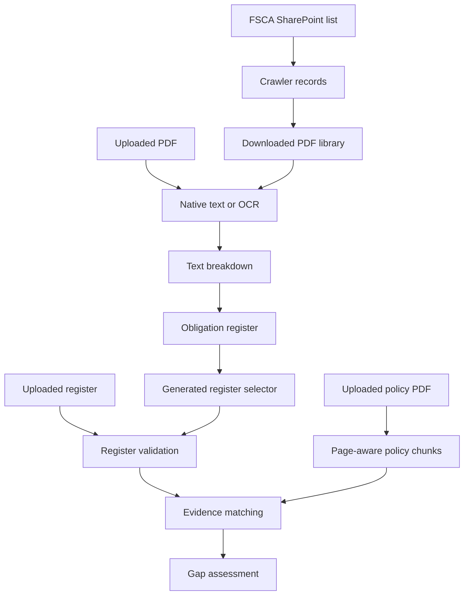

# FSCA Regulatory Compliance Tool

A connected, dark-mode web application with three utilities:

1. **Web Crawler** — reads the live FSCA SharePoint Directives library, filters by category/year, downloads selected PDFs, and stores them for extraction.
2. **Obligation Extraction** — reads native or scanned PDFs, builds a clause-wise regulatory text breakdown, and generates a categorized obligation register.
3. **Policy Gap Reviewer** — compares each obligation only against uploaded policy evidence and generates a reconciled coverage assessment.

The tool works without an AI key. Optional Gemini/Ollama extraction is disabled by default; deterministic rules and the built-in generic insurance-function taxonomy provide a repeatable fallback. An organization-specific `.xlsx` taxonomy can be placed in `backend/taxonomy/` locally and is intentionally ignored by Git.

## Project structure

```text
backend/
  app/
    core/config.py
    routers/
    services/
      crawler_service.py
      pdf_service.py
      breakdown_service.py
      obligation_service.py
      gap_service.py
      taxonomy_service.py
  reference_directives/
  taxonomy/                       # optional local organization-specific .xlsx override
  tests/
  requirements.txt
  run.py
frontend/
  src/App.tsx
  src/App.css
  package.json
  vite.config.ts
docs/
```

## Windows setup

### 1. Backend

Open PowerShell:

```powershell
cd C:\path\to\Regulatory-Compliance-Tool\backend
py -3.12 -m venv .venv
.\.venv\Scripts\Activate.ps1
python -m pip install --upgrade pip
python -m pip install -r requirements.txt
Copy-Item .env.example .env
```

Install Tesseract for scanned directives such as Directive 159:

```powershell
winget install UB-Mannheim.TesseractOCR
```

The default path is already shown in `.env.example`. If Tesseract is installed elsewhere, update `TESSERACT_CMD` in `backend/.env`.

Start the backend:

```powershell
python -m uvicorn app.main:app --host 127.0.0.1 --port 8000
```

Verify it in a second PowerShell window:

```powershell
Invoke-RestMethod http://127.0.0.1:8000/api/health
```

### 2. Frontend

```powershell
cd C:\path\to\Regulatory-Compliance-Tool\frontend
npm.cmd ci
npm.cmd run dev
```

Open `http://localhost:5173`. Vite proxies `/api` to `http://127.0.0.1:8000`, so no extra frontend configuration is needed locally.

For a separately hosted backend, create `frontend/.env`:

```text
VITE_API_BASE_URL=https://your-backend.example.com
```

## Workflow 1: Crawler to gap review

1. Open **Web Crawler**.
2. Select category/year and click **Start Crawling**.
3. Select one or more PDF rows and click **Download Selected**.
4. Open **Obligation Extraction** and select the downloaded directive.
5. Run extraction and review Obligations, Text Breakdown, Statistics, and Process Log.
6. Open **Policy Gap Reviewer** and select the generated register.
7. Upload the internal policy PDF and run the assessment.
8. Download Excel or CSV.

Non-PDF annexures/forms remain visible in the authoritative crawler result but are marked unsupported and cannot be selected for PDF extraction.

## Workflow 2: Direct upload

1. Open **Obligation Extraction**.
2. Upload a directive/circular PDF.
3. Run extraction and download or retain the generated register.
4. Open **Policy Gap Reviewer**.
5. Select the generated register or upload an Excel/CSV register.
6. Upload an internal policy PDF and run the assessment.

## Text-breakdown logic

1. Extract text page by page with PyMuPDF; use pypdf as the native fallback.
2. Score native text readability. Weak/image-only PDFs switch to OCR.
3. OCR tests multiple rotations and page segmentation modes, then retains the most readable page result.
4. Cache successful OCR by the PDF SHA-256 hash. The first scan is slow; repeated processing is near-instant.
5. Remove page headers, common OCR artifacts, and cover-page metadata.
6. Split only on valid line-start digit-dot markers such as `1.`, `2.1`, and `2.2.1`. A missing dot is accepted only for a short uppercase heading.
7. Preserve section number, sequence, page, and original regulatory wording.
8. Keep text before the first valid clause as `Introduction`.
9. Repair only narrow, sequence-proven OCR numbering errors; dates, amounts, and footnotes are not split into clauses.

## Data flow



## Output workbooks

Obligation extraction:

- `Obligations`
- `Text Breakdown`
- `Statistics`
- `Process Log`

Policy gap review:

- `Executive Summary`
- `Gap Assessment`
- `Statistics`
- `Process Log`

CSV exports contain the detailed primary result table.

Coverage status is always one of:

- `Completely Covered`
- `Partially Covered`
- `Completely Missing`

Informational/non-actionable rows receive a one-line insight rather than `NA`. Unfinished parent stems are assessed through their child clauses instead of becoming artificial gaps. Completely covered actionable rows receive no unnecessary recommendation. Completely missing rows have blank policy evidence/page fields, preventing fabricated supporting text. The three status KPI counts always sum to Total Obligations.

When `ENABLE_LLM_GAP_REVIEW=true` and `GEMINI_API_KEY` is configured, the reviewer sends small batches of obligations and their top page-aware policy evidence candidates to Gemini. The prompt requires South African FSCA/FSB jurisdiction analysis, exact evidence quotes, one of the three allowed statuses, and tailored policy wording rather than keyword lists. Returned JSON is validated; invalid or missing responses use the jurisdiction-aware deterministic fallback. Review and approve organizational data-handling requirements before enabling this feature because selected policy text is sent to the configured Gemini API.

## Automated tests

From `backend` with the virtual environment active:

```powershell
python -m unittest discover -s tests -v
```

Tests cover:

- health and request validation;
- clause splitting and date/amount protection;
- crawler false-positive filtering;
- exact-identity reference fallback;
- native PDF extraction and workbook sheet names;
- policy page parsing for native and OCR markers;
- three-status enforcement, evidence safety, and KPI reconciliation.

Frontend production check:

```powershell
cd ..\frontend
npm.cmd run build
```

## Assumptions and limitations

- The live crawler depends on the FSCA public SharePoint list. If FSCA changes its site/list ID or blocks public requests, the two bundled reference directives keep the demo workflow available and Crawl Log records the live failure.
- The live list currently contains six non-PDF files. They are displayed but not sent into PDF extraction.
- OCR quality depends on scan quality and installed Tesseract language data. Directive 159 is supported and rotation-tested, but poor scans may still contain spelling errors.
- First-time OCR is CPU-intensive. Cached repeats are fast; cache files are local and excluded from Git.
- Deterministic obligation classification is review assistance, not legal advice. Enable the optional LLM only after approving data-handling requirements.
- Gap review uses evidence retrieval followed by validated Gemini analysis when enabled, with a jurisdiction-aware deterministic fallback. A compliance professional must approve final classifications and remediation.

## Verified test evidence

See `docs/TEST_EVIDENCE.md` for the latest executed checks and known pending items.
